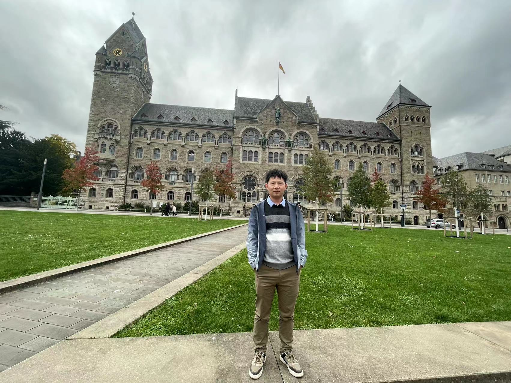

<!DOCTYPE html>
<html lang="zh-CN">
	<head>
	<meta charset="utf-8">
    	<meta http-equiv="X-UA-Compatible" content="IE=edge">
    	<meta name="viewport" content="width=device-width, initial-scale=1">
    	<!-- 上述3个meta标签*必须*放在最前面，任何其他内容都*必须*跟随其后！ -->
    	<meta name="description" content="">
    	<meta name="author" content="">
  	</head>
	<body>
		

		
		<li style="list-style-type: none;"> Hang Huang</li>
		<li style="list-style-type: none;"><a href="mailto:hanghhust@gmail.com">Email: hanghhust@gmail.com</a></li>
		<li style="list-style-type: none;"><a href="https://github.com/huster-hh">GitHub: https://github.com/huster-hh</a></li>
		<li style="list-style-type: none;"><a href="https://github.com/huster-hh/huster-hh.github.io/cv_huang.pdf">CV</a></li>
		

		 
		
 I am a Ph.D. graduate from the School of Computer Science and Technology at Huazhong University of Science and Technology, supervised by Professor <a href="http://cgcl.grid.hust.edu.cn/wusong/"> Song Wu </a>, from 2016 to 2022. During my Ph.D., I also spent one year as a visiting scholar at the University of Texas at Arlington, under the guidance of Professor <a href="https://ranger.uta.edu/~jiang/"> Hong Jiang </a> and <a href="https://ranger.uta.edu/~jrao/"> Jia Rao </a>, from 2018 to 2019. Prior to that, I obtained a Bachelor's degree from the School of Software at Huazhong University of Science and Technology, from 2012 to 2016. Currently, I am working at Alibaba Cloud, specializing in the development and research of secure containers since 2022.
		

		<h2>Research Interests</h2>
		
The goal of my research is to build computer systems that are adaptive to changing workloads, scalable for platform growth, and capable of providing Quality-of-Service guarantees and service differentiation. I am 		especially interested in improving the memory management and scheduling in Cloud systems with a focus on easier application management, especially in the area of containers. My work combines performance analysis at 			both up-level application and low-level OS kernel to characterize the complex behaviors of Cloud systems. He recently works on the following areas:
		<li>Cloud Computing and Virtualization</li>
		<li>Serverless Computing and Containers</li>
		<li>Fairness and Performance Isolation</li>
		<li>Efficient Resource Management on Cloud-native</li>
		<li>Optimization on Linux Kernel</li>
		

		<h2>Publications</h2>
			<ul>
			<li>
PVM: Efficient Shadow Paging for Deploying Secure Containers in Cloud-native Environments   <b>Hang Huang</b>, Jiangshan Lai, Jia Rao, Hui Lu, Wenlong Hou, Hang Su, Quan Xu, Jiang Zhong, Jiahao Zeng, Xu Wang, Zhengyu He, Weidong Han, Jiang Liu, Tao Ma and Song Wu. <i>SOSP 2023 (CCF A-Conference).</i>
</li>
			<li>
Adapt Burstable Containers to Variable CPU Resources   <b>Hang Huang</b>, Yuqing Zhao, Jia Rao, Song Wu, Hai Jin, Duoqiang Wang, Kun Suo, Lisong Pan. <i>TC 2022 (CCF A-Journal).</i>
</li>
			<li>
vKernel: Enhancing Container Isolation via Private Code and Data   <b>Hang Huang</b>, Honglei Wang, Jia Rao, Song Wu, Hao Fan, Chen Yu, Hai Jin, Kun Suo, Lisong Pan. <i>TC 2022 Minor revison (CCF A-Journal).</i>
</li>
   			<li>
Towards Exploiting CPU Elasticity via Efficient Thread Oversubscription   <b>Hang Huang</b>, Jia Rao, Song Wu, Hai Jin, Hong Jiang, Hao Che, Xiaofeng Wu. <i>HPDC 2021 (CCF B-Conference).</i>
</li>
			<li>
Adaptive Resource Views for Containers   <b>Hang Huang</b>, Jia Rao, Song Wu, Hai Jin, Kun Suo, Xiaofeng Wu. <i>HPDC 2021 (CCF B-Conference).</i>
</li>
			<li>
A Performance Study of Containers in Cloud Environment   Bowen Ruan, <b>Hang Huang*</b>, Song Wu, Hai Jin. <i>APSCC 2016 (CCF C-Conference).</i>
</li>
			<li>
Characterizing and optimizing Kernel resource isolation for containers   Kun Wang, Song Wu, Kun Suo, Yijie Liu, <b>Hang Huang</b>, Zhuo Huang, Hai Jin. <i>FGCS 2023 (CCF B-Journal).</i>
</li>
			<li>
SwitchFlow: preemptive multitasking for deep learning   Xiaofeng Wu, Jia Rao, Wei Chen, <b>Hang Huang</b>, Chris H. Q. Ding, Heng Huang. <i>Middleware 2021 (CCF B-Conference Best paper).</i>
</li>
			<li>
Dynamic vertical memory scalability for OpenJDK cloud applications   	Rodrigo Bruno, Paulo Ferreira, Ruslan Synytsky, Tetiana Fydorenchyk, Jia Rao, <b>Hang Huang</b>, Song Wu. <i>ISMM 2018 (CCF C-Conference).</i>
</li>
			</ul>
		<h2>Award</h2>
		<li> 2018 China Scholarship Council</li>
		<li> 2017 Merit Student, National scholarship</li>
		<li> 2016 Guaranteed Admission</li>
		<li> 2014 Outstanding Student Scholarship</li>
	

	</body>
</html>
