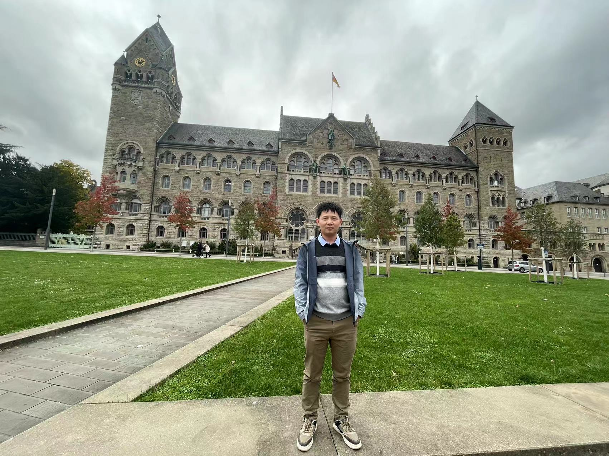

<table width="100%" style="border: none; border-collapse: collapse; width: 100%;">
  <tr style="border: none;">
    <td width="200" align="center" style="border: none; vertical-align: middle;">
      
    </td>
    <td align="left" style="border: none; vertical-align: middle; padding-left: 20px;">
      <h2 style="margin-bottom: 0;">Hang Huang</h2>
      
        📧 hanghhust@gmail.com · 
        <a href="https://github.com/huster-hh">🐙 GitHub</a> · 
        <a href="./cv_huang.pdf">📄 CV</a> · 
        <a href="#english">EN</a> / <a href="#中文">中文</a>
      
        
      <b>Cloud Systems for AI</b> 
      Operating Systems · Virtualization · LLM Systems
    </td>
  </tr>
</table>

---

## 🧑‍💻 About

I am a researcher in **computer systems for AI**, currently with the School of Computer Science and Technology at **Huazhong University of Science and Technology (HUST)**.

I received my Ph.D. from HUST, and was supported by the **China Scholarship Council (CSC)** for joint training in the United States.  
After graduation, I joined **Alibaba Cloud Infrastructure**, working on low-level cloud system design and implementation. I returned to HUST in 2025 to focus on research in **AI-oriented cloud systems**.

My work has been published in top-tier systems venues including **SOSP, OSDI, EuroSys, HPDC, and IEEE TC**, with multiple first-author papers. My research lies at the intersection of **operating systems, virtualization, and large-scale cloud infrastructure for AI workloads**.

I actively collaborate with international universities and major cloud providers (Alibaba Cloud, Huawei Cloud, Tencent Cloud), and have ongoing joint research efforts spanning both academia and industry.

---

## 🔬 Research Overview

My research focuses on **Cloud Systems for AI**, spanning the full software stack from low-level system design to high-level AI infrastructure.

The goal is to build **efficient, scalable, and AI-native cloud systems** that support emerging workloads such as large language models and autonomous agents.

### Key Directions

#### 1. Virtualized AI Infrastructure
Design of virtualization techniques for **compute, memory, storage, network, and accelerators**, enabling efficient deployment of AI workloads (e.g., model-as-a-service, agent-based systems).

#### 2. Agent-oriented Operating Systems
Extending traditional OS abstractions (e.g., Linux) to support **AI agents as first-class entities**, including new execution, scheduling, and resource management models.

#### 3. Secure and Efficient Agent Sandboxing
Next-generation container/runtime systems (Docker, Kata, gVisor, WASM) tailored for **agent workloads**, enabling secure and efficient code execution and tool invocation.

#### 4. LLM Inference Systems
Design of high-performance inference engines (e.g., vLLM, SGLang) and **retrieval-augmented generation (RAG)** systems, supporting long context, dynamic workloads, and multi-modal inference.

#### 5. Agent Systems and Runtime
Building scalable **multi-agent systems**, with support for scheduling, tool integration, and serverless execution in cloud environments.

---

## 📚 Selected Publications

- **PVM: Efficient Shadow Paging for Deploying Secure Containers**  
  *ACM SOSP 2023*

- **(Additional papers in OSDI / EuroSys / HPDC / IEEE TC)**

---

## 🤝 Collaboration & Mentorship

I maintain active collaborations with both academia and industry.  
I welcome students who are interested in:

- Top-tier systems research (SOSP / OSDI / ASPLOS / EuroSys)  
- Pursuing Ph.D. studies abroad  
- Careers in leading cloud and infrastructure companies  

---

## 🧑‍💻 个人简介

我目前在**华中科技大学计算机学院**从事**面向 AI 的云计算系统（Cloud Systems for AI）**研究。

本科、硕士、博士均毕业于华中科技大学，期间获**国家留学基金委（CSC）资助赴美联合培养**。  
毕业后加入**阿里云基础设施事业部**，从事云计算底层系统研发工作，并于 2025 年回到母校专注科研。

本人在系统领域顶级会议/期刊（**SOSP、OSDI、EuroSys、HPDC、IEEE TC**）发表多篇论文，研究方向聚焦于**操作系统、虚拟化与 AI 云基础设施的交叉领域**。

目前与多所海外高校保持长期合作，同时与**阿里云、华为云、腾讯云**等开展持续技术协作。

---

## 🔬 研究方向

围绕 **“面向 AI 的云计算系统（Cloud Systems for AI）”** 展开，覆盖从底层到上层的完整系统软件栈，致力于构建高效、可扩展的 AI 原生云基础设施。

### 核心研究方向

#### 1️⃣ AI算力基础设施虚拟化
面向计算、存储、网络及加速器的虚拟化技术，支撑模型服务化与智能体应用的高效部署。

#### 2️⃣ 智能体操作系统
扩展 Linux 等传统操作系统，为智能体提供新的系统抽象、调度与资源管理机制。

#### 3️⃣ 智能体沙箱与运行时
面向智能体负载，演进容器与运行时技术（Docker / Kata / gVisor / WASM），构建安全高效执行环境。

#### 4️⃣ 大模型推理系统
研究高性能推理引擎（如 vLLM、SGLang）与 RAG 技术，支持长上下文、多模态与动态负载。

#### 5️⃣ 智能体系统
构建多智能体运行框架，实现任务调度、工具增强与 Serverless 化执行。

---

## 🤝 招生与合作

欢迎对系统研究感兴趣的同学加入，方向包括：

- 顶会论文（SOSP / OSDI / ASPLOS / EuroSys）
- 出国深造（PhD）
- 云计算与基础设施企业（阿里 / 华为 / 腾讯）

提供系统性科研指导与工程实践机会。

---
